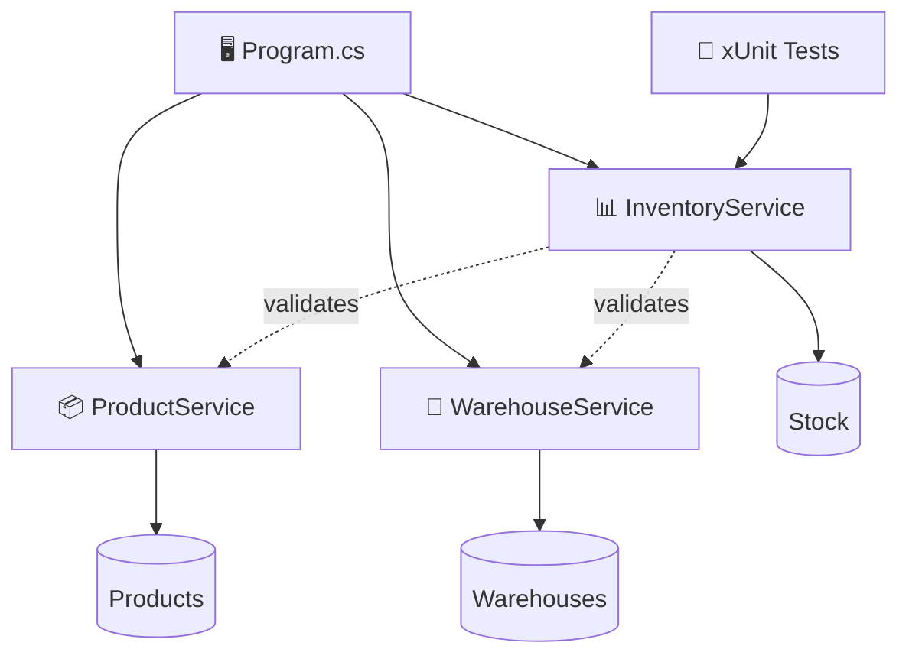

<div align="center">

# 📦 MiniWarehouse-CSharp

### A lightweight warehouse & inventory management system built with C# and .NET


</div>

---

## 🏭 What is MiniWarehouse?

**MiniWarehouse-CSharp** is a small console-based warehouse and inventory management system written in **C# and .NET 10**.

The application models a simple warehouse environment where products can be stored across different warehouses and their stock levels can be managed.

The project focuses on keeping the architecture simple while demonstrating:

- Object-oriented programming
- Separation of responsibilities
- Business logic
- Input validation
- Constructor-based dependency injection
- Unit testing

---

## ✨ Features

- 📦 Product management
- 🏢 Warehouse management
- 📊 Inventory management
- ➕ Add stock
- ➖ Remove stock
- 🔎 Check stock levels
- 🛡️ Product and warehouse validation
- 🧪 Automated unit tests

---

## 🧠 Architecture



### Responsibilities

| Component | Responsibility |
|---|---|
| `ProductService` | Manage products |
| `WarehouseService` | Manage warehouses |
| `InventoryService` | Manage stock |
| `Program.cs` | Console interaction |
| `InventoryServiceTests` | Test inventory behaviour |

---

## 📁 Project Structure

```text
MiniWarehouse-CSharp/
│
├── Models/
│   ├── Product.cs
│   ├── Warehouse.cs
│   └── StockItem.cs
│
├── Services/
│   ├── ProductService.cs
│   ├── WarehouseService.cs
│   └── InventoryService.cs
│
├── MiniWarehouse-CSharp.Tests/
│   └── InventoryServiceTests.cs
│
├── Program.cs
├── MiniWarehouse-CSharp.csproj
├── MiniWarehouse-CSharp.sln
├── .gitignore
└── README.md
```

---

## 🎬 Example

```text
$ dotnet run

=== Mini Warehouse ===

1. Add Stock
2. Remove Stock
3. Check Stock
4. Exit

Choose an option: 1

Product ID: 1
Warehouse ID: 1
Quantity: 50

Stock added successfully.
```

Checking the inventory:

```text
Choose an option: 3

Product ID: 1
Warehouse ID: 1

Current stock: 50
```

---

## 🧪 Testing

Tests follow the classic:

**Arrange → Act → Assert**

### Current test suite

| Scenario | Result |
|---|:---:|
| Add stock | ✅ |
| Add stock to existing inventory | ✅ |
| Remove stock | ✅ |
| Prevent removing unavailable stock | ✅ |
| Reject unknown product | ✅ |
| Reject unknown warehouse | ✅ |

### Current result

**6/6 tests passing.**

Run them with:

```bash
dotnet test MiniWarehouse-CSharp.Tests
```

---

## 🛠️ Tech Stack

| Technology | Purpose |
|---|---|
| C# | Application language |
| .NET 10 | Runtime & framework |
| xUnit | Unit testing |
| Git | Version control |
| GitHub | Repository |

---

## 🚀 Getting Started

### Requirements

- .NET 10 SDK
- Git

### Clone

```bash
git clone <repository-url>
cd MiniWarehouse-CSharp
```

### Run

```bash
dotnet run
```

### Test

```bash
dotnet test MiniWarehouse-CSharp.Tests
```

---

## 🔍 Domain Model

### Product

```text
Product
├── Id
├── SKU
├── Name
└── Price
```

### Warehouse

```text
Warehouse
├── Id
├── Name
└── Location
```

### Stock

```text
Stock
├── ProductId
├── WarehouseId
└── Quantity
```

This allows the system to represent relationships such as:

```text
Mechanical Keyboard
        │
        ▼
Main Warehouse
        │
        ▼
     50 units
```

---

## 🎯 Design Goals

The project deliberately focuses on **clarity over complexity**.

- ✔ Clear responsibilities
- ✔ Simple business logic
- ✔ Input validation
- ✔ Readable code
- ✔ Automated tests
- ✔ No unnecessary abstractions

---

## 🔮 Possible Future Improvements

- 💾 SQLite persistence
- 🔄 Warehouse-to-warehouse stock transfers
- 🔎 Product search
- ⚠️ Low-stock alerts
- 📊 Inventory reports
- 🌐 REST API
- 🖥️ Web interface
- 🔐 Authentication

These are intentionally outside the current scope.

---

## 📈 Development Philosophy

> Build something small enough to understand completely, but structured enough to demonstrate good engineering habits.

**Models → Services → Business Logic → Tests**

---

## 📜 License

This project is licensed under the MIT License.

<div align="center">

### 📦 Built with C# • .NET • Curiosity

**MiniWarehouse-CSharp**

</div>